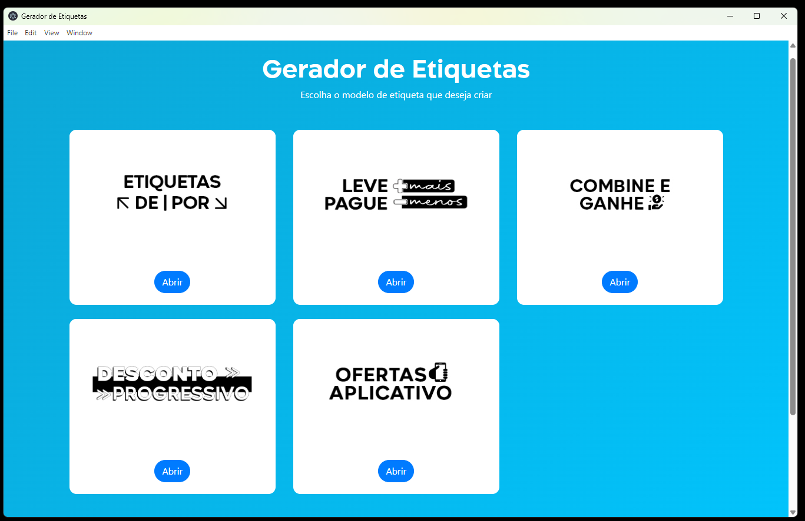
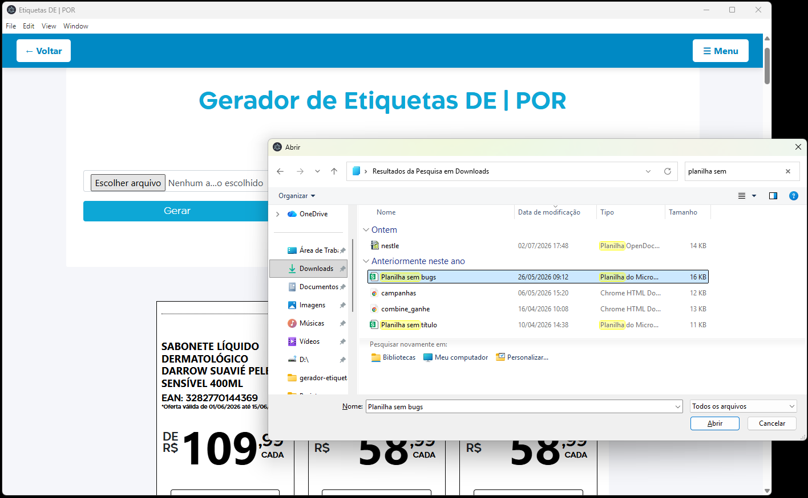
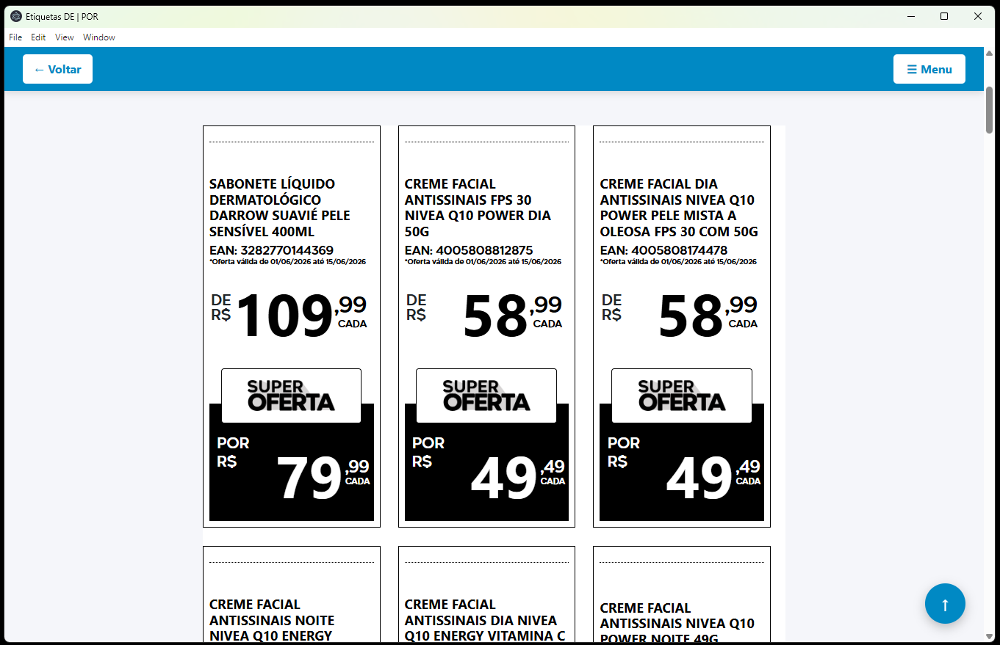
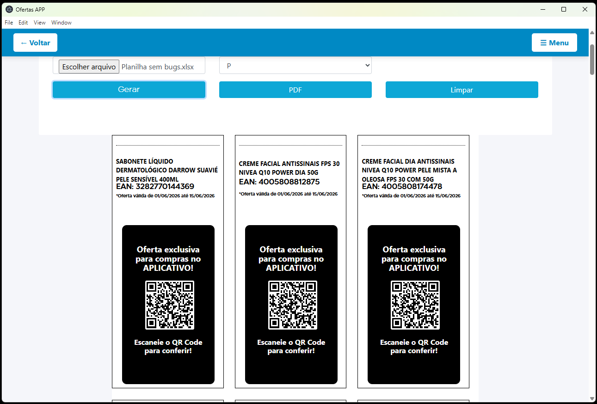

# 🏷️ Label Generator Desktop  
## Sistema de automação de etiquetas promocionais e campanhas de marketing

---

## 📌 Visão Geral

O **Label Generator Desktop** é uma aplicação desenvolvida para automatizar a criação de etiquetas promocionais utilizadas em campanhas de Marketing e Trade Marketing.

O sistema foi criado a partir de uma necessidade real de otimização de processos internos, onde a criação de etiquetas era feita manualmente no Photoshop, exigindo edição individual e gerando alto tempo de produção e retrabalho.

A solução automatiza todo o fluxo de geração de etiquetas, desde a importação de dados até a exportação final para impressão ou distribuição digital.

---

## 🎯 Objetivo do Sistema

Centralizar e automatizar a criação de materiais promocionais, reduzindo tempo operacional e garantindo padronização visual em campanhas.

---

## ⚙️ Funcionalidades

### 📊 Gestão de Dados
- Importação de arquivos Excel
- Integração com Google Sheets (em desenvolvimento)
- Seleção automática de linhas para geração (em desenvolvimento)
- Importação de logo das campanhas

### 🏷️ Geração de Etiquetas
- Criação automática de etiquetas promocionais
- Suporte a diferentes modelos de campanhas
- Layouts otimizados para impressão em A4
- Organização automática de páginas

### 🖨️ Exportação
- Exportação de etiquetas em PDF
- Preparação para impressão profissional
- Organização automática do layout final

### 💾 Distribuição
- Instalador executável (.exe) para Windows

### 📱 Marketing Digital
- Geração de etiquetas com QR Code
- Direcionamento para download de aplicativo
- Suporte a campanhas de ofertas exclusivas
- Integração entre físico e digital (omnichannel)

---

## 🧰 Tecnologias Utilizadas

- Electron
- Node.js
- JavaScript
- HTML5
- CSS3
- Bootstrap
- Excel parsing
- Google Sheets API (em desenvolvimento)

---

## 📊 Impacto do Sistema

- Redução significativa do tempo de criação de etiquetas
- Eliminação de processos manuais repetitivos
- Padronização visual das campanhas promocionais
- Aumento de produtividade do setor de Marketing e Trade Marketing
- Integração entre campanhas físicas e digitais
- Redução de erros operacionais

---

## 🧠 Diferenciais do Projeto

- Sistema desktop completo com instalador (.exe)
- Automação de fluxo real de empresa
- Integração com dados externos (Excel / Google Sheets)
- Geração de QR Code para campanhas digitais
- Foco em produtividade e escala operacional

---

## 📸 Demonstração

### 🖥️ Interface do sistema

### 📊 Importação de dados

### 🏷️ Geração de etiquetas

### 📱 Etiqueta com QR Code

---

## 🚀 Próximas Evoluções

- Integração completa com Google Sheets API
- Editor visual de templates de etiquetas
- Dashboard de campanhas
- Histórico de gerações
- Sistema de usuários
- Tracking de QR Code escaneado

---

## 📁 Status do Projeto

🚧 Em evolução contínua

---

## 👨‍💻 Autor

Desenvolvido por **Nildson Campos**  
Projeto focado em automação de processos e melhoria de eficiência no setor de Marketing e Trade Marketing.
